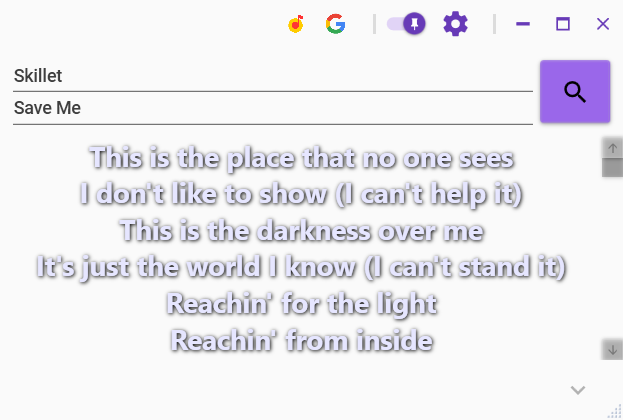
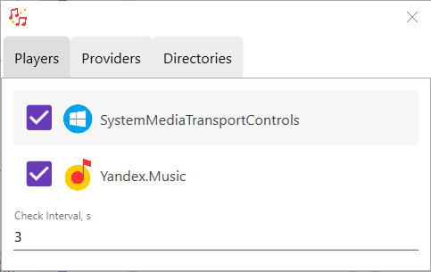

## Lyrixound

**Lyrixound** - приложение для поиска и отображения текстов песен.

### Особенности приложения
* автоматическое определение текущего трека, независимо от плеера или браузера, в котором он воспроизводится
* поиск текста песни в различных источниках
* ручной поиск по названию/исполнителю песни
* автоматическое сохранение найденного текста в файл
* отображение поверх всех окон, скрытие лишних элементов при переключении на другое окно
* настройка цвета, размера, шрифта и других параметров внешнего вида текста
* возможность открыть источник текста песни

### Внешний вид

* область с текстом песни
* поля, отображающие название/исполнителя и кнопка для поиска
* верхняя панель с общей информацией и кнопками настроек
* раскрывающаяся нижняя панель для тонкой настройки внешнего вида текста песни

### Настройки программы

#### Плееры для наблюдения
Проверка плееров на текущий трек происходит с указанной периодичностью, для отмеченных галочкой плееров. Их порядок можно менять перетаскиванием.

**Поддерживаемые наблюдатели:**
1. ***SystemMediaTransportControls*** - программа считывает информацию о текущем треке при появлении системного окна с медиа информацией. Данное окно отображается в *Windows 10* при нажатии сочетания клавиш для изменения громкости звука, либо при переключении трека, установке на паузу.
2. ***Yandex.Music*** - проверка состояния плеера [Yandex.Music](https://www.microsoft.com/store/apps/9NBLGGH0CB6D). Программа не может считать данные трека, если плеер находится в свернутом состоянии.

#### Провайдеры для поиска текстов песен
Есть возможность включать необходимые провайдеры и указывать очередность поиска.

**Доступные провайдеры:**
1. ***Directories*** - поиск в папках. Настройка папок доступка на соответствующей вкладке.
2. ***Google*** - веб-поиск текста песен в [Google](http://google.com/).

#### Настройка директорий
Указывается путь к папке, куда программа автоматически сохраняет найденные песни. Названия файлов имеют вид в соответствии с указанным шаблоном.